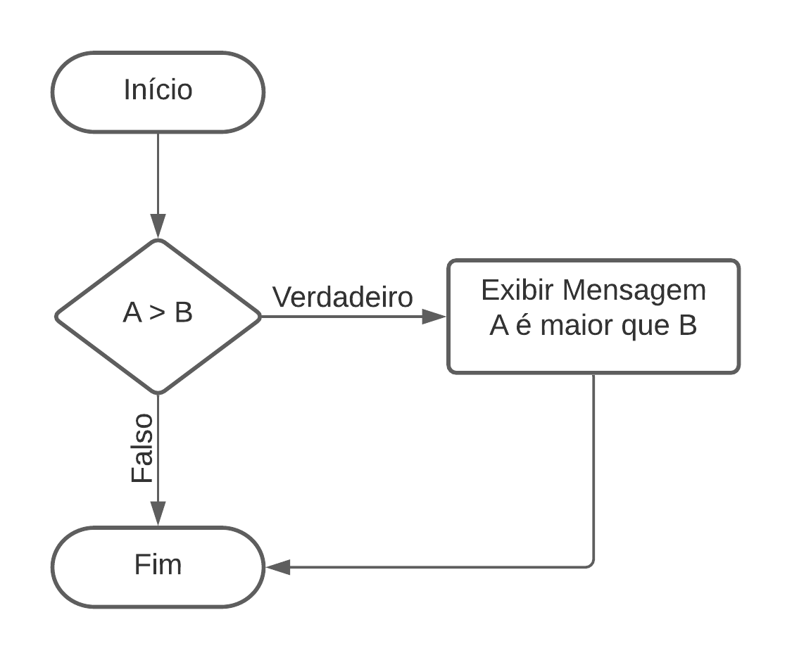
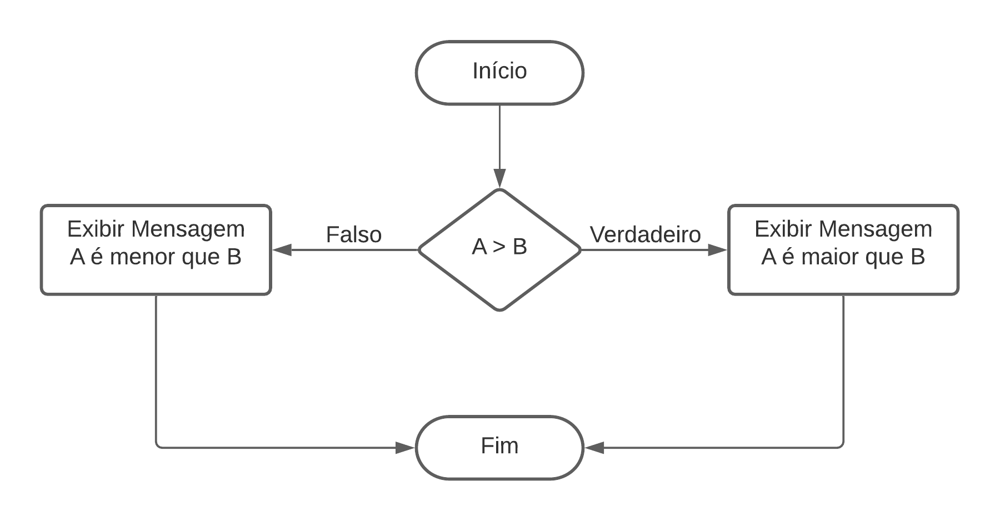
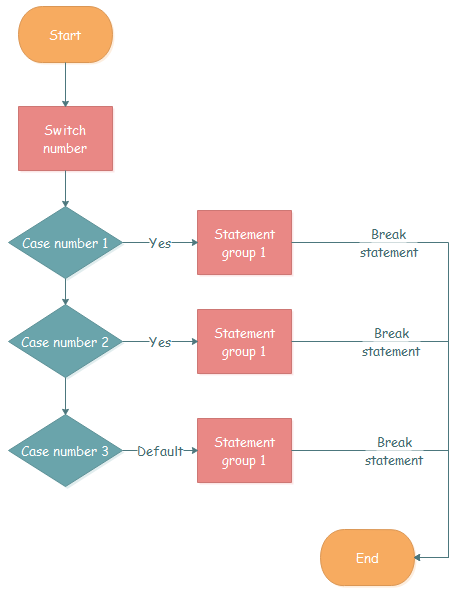
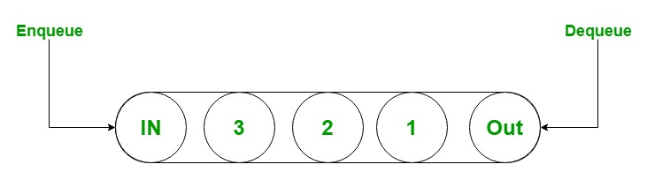
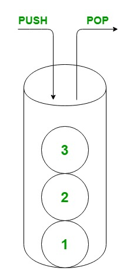


## Condicionais

É uma estrutura que indica quais instruções o sistema deve processar de acordo com uma expressão booleana
Exemplo:

#### IF/ELSE

```
if (expressão booleana)
{
  // se verdade entra aqui
}
else
{
  // se falso entra aqui
}
```

Para facilitar o entendimento segue um fluxo grama:



Estrutura condicional composta:



Há uma outra forma também de escrever a mesma estrutura, conhecido como operador ternario;

```
expressão booleana ? código 1 : código 2;
exmeplo:

var numero = 10;

parOuImpa = numero % 2 == 0 "é par": "é impar":

Console.WrteLine(parOuImpa);

Saida: é par
 
```

## Switch/Case

É uma estrutura de condição que define o código a ser executado com base em uma comparação de valores.


```
switch (variável)
{
case valor1:
      // código 1      
break;
case valor2:
      // código 2
}
```

Note o uso do **break** é utilizado para especificar a última linha de código a ser executada, caso
não exista ele iria exeucat o outro trecho de comparação.
Exemplo:

```
switch (variável)
{
case valor1:
case valor2:
      // código para caso que ocorra no valor1 e valor2
break;
case valor3:
     // codigo
break;     

}
```



## Loops
Executam repetidamente uma instrução ou um bloco de instruções, são eles:

* **FOR**
* **FOREACH**
* **WHILE**
* **DO WHILE**


#### FOR

Executa uma instrução ou um bloco de instruções enquanto uma expressão booliana especificada é avaliada como true.

```

for (int i = 0; i < 3; i++)
{
    Console.Write(i);
}

// Saida:
// 012

```

#### FOREACH
Executa uma instrução ou um bloco de instruções para cada elemento.

```
var frutas = new List<string> { "Laranja", "Limão", "Uva"};


foreach (var fruta in frutas)
{
    Console.WriteLine(fruta);
}

 Saida:
 Laranja
 Limão
 Uva

```

#### WHILE

Executa uma instrução ou um bloco de instruções enquanto uma expressão booliana especificada é avaliada como true.

```
int n = 0;
while (n < 5)
{
    Console.Write(n);
    n++;
}
 Saida:
 01234

```

#### DO WHILE

Executa uma instrução ou um bloco de instruções enquanto uma expressão booliana especificada é avaliada como true.
Diferente do **WHILE** ele ao menos é executado pelo meno uma unica vez.

```
int n = 0;
do
{
    Console.Write(n);
    n++;
} while (n < 5);
 saida:
 01234
 
int n = 5;
do
{
    Console.Write(n);
    n++;
} while (n < 5);
 saida:
 5 

```

## Operadores

Os operadores são divididos em alguns grupos:

- Operadores aritméticos: que executam operações aritméticas com operandos numéricos
- Operadores de comparação: que comparam operandos numéricos
- Operadores lógicos boolianos: que executam operações lógicas com bool operandos
- Operadores bit a bit e shift que executam operações bit a bit ou shift com operandos dos tipos integrais
- Operadores de igualdade: que verificam se seus operandos são iguais ou não

#####Operadores Aritméticos:


| Símbolo | Operação      | Exemplo | Descrição                                                                |
| ---------- | ----------------- | --------- | ---------------------------------------------------------------------------- |
| **+**    | Adição        | a + b   | Soma os dois operandos                                                     |
| **-**    | Subtração     | a - b   | Subtrai o segundo operando do primeiro                                     |
| \*       | Multiplicação | a\* b   | Multiplica os dois operandos                                               |
| **/**    | Divisão        | a / b   | Divide o primeiro operando pelo segundo                                    |
| **%**    | Módulo         | a % b   | Divide o primeiro operando pelo segundo operando e produz a parte restante |

Vale Resaltar que as operações seguem a procedencia como nas operações matematicas.

##### Operadores de comparação:


| Símbolo | Operação           | Exemplo | Descrição                                        |
|---------|--------------------|---------|--------------------------------------------------|
| **>**   | Maior que          | a > b   | Verdadeira se**a** for maior que **b**.          |
| <       | Menor que          | a < b   | Verdadeira se**a** for menor que **b**           |
| **>=**  | Maior ou igual que | a >= b  | Verdadeira se**a** for maior ou igual que **b**. |
| <=      | Menor ou igual que | a <>= b | Verdadeira se**a** for menor ou igual que **b**. |
| **==**  | Igual a            | a == b  | Verdadeira se**a** igual a **b**.                |
| **!=**  | Diferente de       | a != b  | Verdadeira se**a** for diferente de **b**.       |

##### Operadores Lógico:


| Símbolo | Operação | Exemplo                      | Descrição                                                                                                                                                                           |
|---------|----------|------------------------------|-------------------------------------------------------------------------------------------------------------------------------------------------------------------------------------|
| **&**   | E        | Exp1 **&** Exp2              | Verdadeira se expr1 e expr2 forem verdadeiras.                                                                                                                                      |
| **&&**  | E        | Exp1 **&&** Exp2 **&&** Exp3 | Verdadeira se expr1 e expr2 e exp3 forem verdadeiras. Detalhe aqui é que se a expressão 1 ou 2 forem false ele não ira vericar a expressão 3. Também conhecido como curto circuito  |
| **!**   | Ou       | Exp1 **!**  Exp2             | Verdadeira se expr1 ou expr2 forem verdadeiras.                                                                                                                                     |
| **!!**  | Ou       | Exp1 **!!** Exp2 **!!** Exp3 | Verdadeira se expr1 ou expr2 ou exp3 forem verdadeiras. Detalhe aqui é que se a expressão 1 ou 2 forem true ele não ira vericar a expressão 3. Também conhecido como curto circuito |  

OBS: coloquei o **!** como **OU** porque não conseguir representa ele aqui, por ser uma palavra reservada


## Métodos
É um bloco de código que contém uma série de instruções que podem ou não retorna algum valor ou podem ou não receber algum parametro. Métodos são declarados em uma classe,struct ou interface.


```

public decimal Somar(decimal valor1, decimal valor2)
{
  return valor1 + valor2;
}

public void Imprimir()
{
  Console.WriteLine("alguma informação");
}

```
## Sobrecarga
O C# permite que nós tenhamos vários métodos com o mesmo nome desde que sua assinatura seja diferente.
O compilador trata um método sobrecarregado, quando este método for chamado, da seguinte maneira: primeiramente o compilador selecionará o método correto examinando o numero, em seguida os tipos e por fim a ordem dos argumentos da chamada

```

public void Imprimir()
{
  Console.WriteLine("alguma informação será impressa");
}

public void Imprimir(string info)
{
  Console.WriteLine(" a informação {0} foi  impressa {0}",info);
}

```


## Parâmetros
Argumentos podem ser passados para parâmetros por valor ou por referência.

#### in
A in palavra-chave faz com que os argumentos sejam passados por referência, mas garante que o argumento não seja modificado;

```
public static void Main(String[] args)
{

    int readonlyArgument = 44;
    PassagemParamentroIn(readonlyArgument);
    Console.WriteLine(readonlyArgument);

}

private static void PassagemParamentroIn( in int paramentro )
{
   
    // Uncomment the following line to see error CS8331
    //paramentro = 10;
    
}
```

#### ref

A ref palavra-chave indica que um valor é passado por referência. Ela é usada em quatro contextos diferentes

```
public static void Main(String[] args)
{
    int number = 44;
    PassagemParamentroIn(ref number);
    Console.WriteLine(number);

}

private static void PassagemParamentroIn( ref int paramentro )
{

    paramentro += 10;

}

Saida:
54


```

#### out

A palavra-chave out faz com que os argumentos sejam passados por referência.  
A diferen entre **ref** é que o ref requer que seja inicialzado diferente de **out**

```
public static void Main(String[] args)
{
  int number;
  PassagemParamentroIn(out number);
  Console.WriteLine(number);

}

private static void PassagemParamentroIn( out int paramentro )
{

  paramentro = 10;

}

Saida:
10

```

## Coleções

### Array

Coleção mais basica

```
string[] frutas =
{
    "Banana",
    "Laranja",
    "Uva"
};

Console.WriteLine("Tamanho do array {0} ", frutas.Length);

Console.WriteLine("Elemento do array de indice 1: {0}", frutas[1]);

for (int i = 0; i < frutas.Length; i++)
{
    Console.WriteLine("Elemento do array de indice {0}: {1}",i, frutas[i]);
}

```

### Dictionary
Permite que você acesse elementos em uma coleção usando a chave de cada elemento.

```
Dictionary<string, string> pessoas = new Dictionary<string, string>();

pessoas.Add("189345678","Joao");
pessoas.Add("123456788","Maria");
pessoas.Add("129936782","Pedro");
pessoas.Add("863456789","Jose");

Console.WriteLine("Buscando {0} pelo seu Key: 129936782", pessoas["123456788"]);

foreach (var pessoa in pessoas)
{
    Console.WriteLine("key: {0} value {1}" , pessoa.Key,pessoa.Value);
}

Saida: 

Buscando Maria pelo Key: 129936782
key: 189345678 value Joao
key: 123456788 value Maria
key: 129936782 value Pedro
key: 863456789 value Jose
 
```
### SortDictionary
Representa uma coleção de pares chave/valor que são classificados na chave

```

SortedDictionary<string, string> pessoasSort = new SortedDictionary<string, string>();
Dictionary<string, string> pessoasNoSort = new Dictionary<string, string>();

pessoasSort.Add("2","Joao");
pessoasSort.Add("4","Maria");
pessoasSort.Add("3","Pedro");
pessoasSort.Add("5","Jose");
pessoasSort.Add("1","Atonio");


pessoasNoSort.Add("2","Joao");
pessoasNoSort.Add("4","Maria");
pessoasNoSort.Add("3","Pedro");
pessoasNoSort.Add("5","Jose");
pessoasNoSort.Add("1","Atonio");

Console.WriteLine("Com Sort");
foreach (var pessoa in pessoasSort)
{
    Console.WriteLine("key: {0} value {1}" , pessoa.Key,pessoa.Value);
}

Console.WriteLine();

Console.WriteLine("Sem Sort");
foreach (var pessoa in pessoasNoSort)
{
    Console.WriteLine("key: {0} value {1}" , pessoa.Key,pessoa.Value);
}

Saida:
Com Sort
key: 1 value Atonio
key: 2 value Joao
key: 3 value Pedro
key: 4 value Maria
key: 5 value Jose

Sem Sort
key: 2 value Joao
key: 4 value Maria
key: 3 value Pedro
key: 5 value Jose
key: 1 value Atonio


```
Como podem observa usamos a mesma ordem ao adcionar os itens na coleção porem o SortDictionary é ordenado pela sua chave
diferente Dictionary


### Hashtable 
Representa uma coleção de pares chave-valor organizados com base no código hash da chave.

```
try
{
    Hashtable aulas = new Hashtable();

    aulas.Add("pt", "Portugues");
    aulas.Add("mt", "Matematica");
    aulas.Add("ht", "historia");
    aulas.Add("fs", "fisica");


    foreach (DictionaryEntry aula in aulas)
    {
        Console.WriteLine("Aular {0} de key {1}", aula.Value, aula.Key);
    }
    
    aulas.Add("fs", "teste");

}
catch (Exception)
{
    Console.WriteLine("Adicione um novo elemento com uma key já existente");
}

Saida:

Aula Portugues de key pt
Aula historia de key ht
Aula Matematica de key mt
Aula fisica de key fs
Adicione um novo elemento com uma key já existente


```

Vale Ressalta que apesa de do **Hashtable** e do **Dictionary* serem parecidos temos algumas diferenças importante:  

| Hashtable                                                                                                           | Dictionary                                                                                                 |
|---------------------------------------------------------------------------------------------------------------------|------------------------------------------------------------------------------------------------------------|
 | Uma  Hashtable é uma coleção não genérica                                                                           | Um Dictionary é uma coleção genérica                                                                       |
 | Em uma Hashtable, você pode armazenar pares de chave/valor do mesmo tipo ou de tipos diferentes.                    | Em um Dictionary, você pode armazenar pares de chave/valor do mesmo tipo.                                  |
 | Em uma Hashtable, não há necessidade de especificar o tipo de chave e valor.                                        | Em um Dictionary você precisa especificar o tipo da chave e valor.                                         |
| A recuperação de dados é mais lenta do que em um Dictionary devido ao boxing/unboxing.                              | A recuperação de dados é mais rápida do que Hashtable devido a não ter que realizar o  boxing/unboxing.    |
| Em uma Hashtable, se você tentar acessar uma chave que não está presente na Hashtable, ela fornecerá valores nulos. | Em um Dictionary, se você tentar acessar uma chave que não está presente no Dicionário , ocorrerá um erro. |
 | É Thread-Safe                                                                                                       | É Thread safe somente para os membros públicos e estáticos                                                 |
| Não mantém a ordem dos valores armazenados                                                                          | Sempre mantém a ordem dos valores armazenados                                                              |

### HashSet
Representa um conjunto de valores.

```

var animais = new HashSet<string> { "Gato","Leao", "Cachorro","Lobo", "Papagaio","Piriquito" };
var felinos = new HashSet<string> { "Gato","Leao" };
var caninos = new HashSet<string> {  "Cachorro","Lobo" };

var passaros = new HashSet<string> { "Papagaio","Piriquito" };


if (felinos.IsSubsetOf(animais))
{
    Console.WriteLine("felinos é um subconjunto de animais");
}

if (caninos.IsSubsetOf(animais))
{
    Console.WriteLine("caninos é um subconjunto de animais");
}

if (passaros.IsSubsetOf(animais))
{
    Console.WriteLine("passaros é um subconjunto de animais");
}

var todosAnimais = new HashSet<string>();

todosAnimais.UnionWith(passaros);
todosAnimais.UnionWith(felinos);
todosAnimais.UnionWith(passaros);

if (todosAnimais.IsSubsetOf(animais))
{
    Console.WriteLine("todosAnimais é um subconjunto de animais");
}

Saida:
felinos é um subconjunto de animais
caninos é um subconjunto de animais
passaros é um subconjunto de animais
todosAnimais é um subconjunto de animais


```

### Queue
Representa uma coleção primeiro a entrar, primeiro a sair de objetos.



```

Queue carros = new Queue();
carros.Enqueue("Carro 1");
carros.Enqueue("Carro 2");
carros.Enqueue("Carro 3");

Console.WriteLine( "Carros na fila de pedagio\n");

foreach ( var carro in carros )
    Console.WriteLine( "{0}", carro );

Console.WriteLine();

while (carros.Count > 0)
{
    Console.WriteLine( "Pedagio do {0} pago", carros.Dequeue() );
}

Console.WriteLine();

Console.WriteLine("Carros em fila de pedagio {0}",carros.Count );

Sáida:

Carros na fila de pedagio

Carro 1
Carro 2
Carro 3

Pedagio do Carro 1 pago
Pedagio do Carro 2 pago
Pedagio do Carro 3 pago

Carros em fila de pedagio 0


```

## Stark
Representa uma coleção não genérica simples UEPS (último a entrar, primeiro a sair) de objetos.



```
Stack<string> pratos = new Stack<string>();


Console.WriteLine( "Pratos Sujos antes do almoço {0} \n",pratos.Count);

for (int i = 0; i < 10; i++)
{
    pratos.Push("Prato "+(i+1));
}

Console.WriteLine( "Pratos Sujos depois do almoço {0} \n",pratos.Count);

Console.WriteLine();

while (pratos.Count > 0)
{
    Console.WriteLine( "{0} lavado", pratos.Pop() );
}

Console.WriteLine();

Console.WriteLine( "Pratos Sujos depois que me dei ao trabalho de lava {0} \n",pratos.Count);

saida:

Pratos Sujos antes do almoço 0 

Pratos Sujos depois do almoço 10

Prato 10 lavado
Prato 9 lavado
Prato 8 lavado
Prato 7 lavado
Prato 6 lavado
Prato 5 lavado
Prato 4 lavado
Prato 3 lavado
Prato 2 lavado
Prato 1 lavado

Pratos Sujos depois que me dei ao trabalho de lava 0 

```

## Qual Coleção usar ???

Segue alguns cenários onde cada uma faria sentido usar.

#### Array
Quando vc pretende trabalhar com coleções de tamanho fixo ou arquivos e valores de baixo nivel

#### Stack(pilha)

Imagine cenário onde vc tem uma pilha de pratos onde o primeiro prato a ser colocado ser ficara
abaixo do demais pratos empinhados nesse caso seria um fote candidato para o uso do **Stack**

#### Queue(Fila)

Imagine o cenário onde sua coleção o elemento que será removido será sempre o primeiro a entra,
seguindo esse pensamento imagine uma fila de carro ou pedagio, onde o primeiro a entra é sempre o primeiro a sair.


#### HashSet
Indicado para operações de conjunto, como saber se um elemento está contido ou não em uma coleção ou paras
saber se as duas coleções possuem um ou mais elementos em comum.


#### Dictionary
Indicado quando vc tem coleções que precisam trabalhar com chave e valor.   
exemplo: coleções de pessoas com CPF;

125938749858 Maria   
253298749638 Pedro  
193865749858 Joao  
596969938858 Jose  

#### List
Lista mais dinamica e poderosa, onde você poder, ordenar, reverte e adicionar um item em qualquer posição ou remover
É indicado quando vc quer manipular uma lista de elemento mas detalhadamente

#### LinkedList 
Quando a situações onde é nescessário remover ou inserir grandes quantidade de dados de maneira rapida
Como ele permite inserir elementos no inicio ou no fim ou antes e depois de outro elemento.


## NameSpace

São usado com frequência para Organizar tipos, outra coisa que podemos fazer também é fazer o uso de qualquer classe quando importando o seu nameSpace usando a palavra reservada using.
Exemplos:

Sem o uso do nameSpance:

```
System.Console.WriteLine("Hello World!");
string path = @"c:\temp\MyTest.txt";
bool exist = Sistem.IO.File.Exists(path);

```

Com o uso do NameSpace:

```
using System;
using System.IO;

Console.WriteLine("Hello World!");
string path = @"c:\temp\MyTest.txt";
bool exist = File.Exists(path);
```

Como também podemos nota foi organizado dentro de outro NameSpace IO o File Classe, ou seja em projetos de muitos arquivo é fundamento o uso de NameSpace para melhor organizar e da ideia de onde podemos encontrar o que desejamos.

## Classes

É um tipo de dados formado por dados e comportamento

```
class Pessoa
{
    private string nome;
    private int idade;

    public Pessoa(string nome, int idade)
    {
        this.nome = nome;
        this.idade = idade;
    }

    public void Imprimir()
    {
        Console.WriteLine("{0}, {1} anos.", nome, idade);
    }
}

Pessoa joao = new Pessoa("João",30);
Pessoa maria = new Pessoa("Maria",25);
Pessoa jose = new Pessoa("Jose",36);

joao.Imprimir();
maria.Imprimir();
jose.Imprimir();


/* saida:
    Pessoa #1: João, 30 anos.
    Pessoa #2: Maria, 25 anos.
    Pessoa #3: Jose, 36 anos.
*/
```

Observe que a propriedade nome e idade só teve acesso no metodo construto da class no qual será preenchido ao instancia um novo objeto.

## Structs

É um tipo de valor(Value Types) que pode encapsular dados e funcionalidades relacionadas.

```
public struct Pessoa
{
     public string nome { get; }
     public int idade { get; }

    public Pessoa(string nome, int idade)
    {
        this.nome = nome;
        this.idade = idade;
    }

    public void Imprimir()
    {
        Console.WriteLine("{0}, {1} anos.", nome, idade);
    }
}

Pessoa joao = new Pessoa("João",30);
Pessoa maria = new Pessoa("Maria",25);
Pessoa jose = new Pessoa("Jose",36);

joao.Imprimir();
maria.Imprimir();
jose.Imprimir();


/* saida:
    Pessoa #1: João, 30 anos.
    Pessoa #2: Maria, 25 anos.
    Pessoa #3: Jose, 36 anos.
*/

```

Apesar da grande semenhança em relação a classe temos algumas diferente:

- Struct são tipos de valores e Classes são tipo de referencia(Reference Types)
- Quando se atribui um valor de uma variável com valor de outra variável, é sempre feita uma cópia do conteúdo e não feita a referência
- Um tipo de estrutura não pode herdar de outro tipo de classe ou estrutura e não pode ser a base de uma classe. No entanto, um tipo de estrutura pode implementar interfaces.
  Você não pode declarar um finalizador dentro de um tipo de estrutura.
- Antes do C# 11, um construtor de um tipo de estrutura deve inicializar todos os campos de instância do tipo.
- Antes do C# 10, você não pode declarar um construtor sem parâmetros.
- Antes do C# 10, você não pode inicializar um campo de instância ou propriedade em sua declaração.

## Certo então quando devemos usar Struct ao ivens de Class??? o.O

Bom os melhores candidatos para viram Struct são os Data Transfer Objects, que são os famosos DTO.
OBS: é a minha opinião, você também pode usa onde a classe faz apenas simples operações.

# Contrutores
São metodos cujo seu nome é igual ao seu tipo. Construtores são executado quando uma Slasse ou Struct é criada.  
Contrutores permitem que sejá definidos valores padrão quando for executado.

Exempo:

```
public Class Pessoa {

    public string nome { get;set; }
    public int idade { get;set; }

    public Pessoa()
    {
 
    }
    
    public Pessoa(string nome, int idade)
    {
        this.nome = nome;
        this.idade = idade;
    }

}

Pessoa joao = new Pessoa("João",30);
Pessoa maria = new Pessoa();

maria.Nome = "Maria";
maria.idade = 20;

```

Obseve que no objeto do tipo pessoa joão iniciamos como alguns valores, equanto no objeto maria setamos seus valores individualmente
veja que no exemplo acima temos mais de um construtor, podemos ter mais de um construto mais com assinaturas diferente.


## Destrutores
São metodos cujo seu nome é igual ao seu tipo precedido por **~**. Destrutores são executado quando um objeto é destruido, quem fica a cargo dessa tarefa é o
GC(Garbage Collector). não possivel chamado diretamente.

```
class First
{
    ~First()
    {
        System.Diagnostics.Trace.WriteLine("First's finalizer is called.");
    }
}

class Second : First
{
    ~Second()
    {
        System.Diagnostics.Trace.WriteLine("Second's finalizer is called.");
    }
}

class Third : Second
{
    ~Third()
    {
        System.Diagnostics.Trace.WriteLine("Third's finalizer is called.");
        
    }
}

class Program
{
    static void Main()
    {
        Third t = new Third();
        t = null;
        
    }
}

Saida:
Third's finalizer is called.
Second's finalizer is called.
First's finalizer is called.

```
* Os finalizadores não podem ser definidos em structs. Eles são usados somente com classes.
* Uma classe pode ter somente um finalizador.
* Os finalizadores não podem ser herdados ou sobrecarregados.
* Os finalizadores não podem ser chamados. Eles são invocados automaticamente.
* Um finalizador não usa modificadores ou não tem parâmetros.


## Níveis de acessibilidade

Niveis de acesso também conhecido como **Modificadores de acesso** ou como **Encapsulamento** que é um dos pilares da programação OO.  
Usamos modificadores de acesso para evitar que algum dados ou metodos sofram acesso indevidos, dentros os modificadores de acesso temos:
* **public:**	O acesso não é restrito.
* **protected:**	O acesso é limitado à classe que os contém ou aos tipos derivados da classe que os contém.
* **internal:**	O acesso é limitado ao assembly atual.
* **protected internal:**	O acesso é limitado ao assembly atual ou aos tipos derivados da classe que os contém.
* **private:**	O acesso é limitado ao tipo recipiente.
* **private protected**:	O acesso é limitado à classe que o contém ou a tipos derivados da classe que o contém no assembly atual. Disponível desde o C# 7.2.


## System.Text

#### StringBuilder
O StringBuilder é usado quando vc deseja manipular diversas vezes uma cadeia de caractres sem ser preciso criar um novo objeto já que o System.String é imutavel 
e todas vez que uma cadeias de caractres é alterado é criado um novo objeto na mémoria.

Segue alguns metodos:
* Append: pode ser usado para adicionar texto
* Insert: pode ser usado para adicionar texto em uma posição especifica
* Remove: pode ser usado para remover uma parte especifica do texto
* Replace: pode ser usado para substitui texto

Exemplos:

```
StringBuilder myStringBuilder = new StringBuilder("Bem vido ao mundo de desenvolvimento");
myStringBuilder.Append(" em C#.");
Console.WriteLine(myStringBuilder);

saida: Bem vido ao mundo de  desenvolvimento em C#.

StringBuilder myStringBuilder = new StringBuilder("Bem vindo ao mundo de desenvolvimento em C#.");
myStringBuilder.Insert(9," brow");
Console.WriteLine(myStringBuilder);

saida: Bem vindo brow ao mundo de desenvolvimento em C#.

StringBuilder myStringBuilder = new StringBuilder("Bem vindo brow ao mundo de desenvolvimento em C#.");
myStringBuilder.Remove(10,5);
Console.WriteLine(myStringBuilder);

saida: Bem vindo ao mundo de desenvolvimento em C#.

StringBuilder myStringBuilder = new StringBuilder("Bem vindo brow ao mundo de desenvolvimento em C#.");
myStringBuilder.Replace(".","!!!");
Console.WriteLine(myStringBuilder);

saida: Bem vindo brow ao mundo de desenvolvimento em C#!!!

```
#### Encoding

Converte um conjunto de caracteres em uma sequência de bytes

```

string texto = "Convertendo string para array de byte";  
  
byte[] bytes = Encoding.ASCII.GetBytes(texto);

string textoConvertido = Encoding.UTF8.GetString(bytes);
        
Console.WriteLine(textoConvertido);

saida: Convertendo string para array de byte

```

#### Normalize

Retorna uma nova cadeia de caracteres cuja representação binária está em um formulário de normalização Unicode específico.


```
var teste = "café".Normalize(NormalizationForm.FormKD) .Where(ch => char.GetUnicodeCategory(ch) != UnicodeCategory.NonSpacingMark)  
            .ToArray();
        
Console.WriteLine(teste);

saida: cafe

```

## System.Threading

#### Thread
São mecanimos que permite ter mais de um fluxo de controle na aplicação.

```

    public static void Main(String[] args)
    {
        Thread.CurrentThread.Name = "Principal";
        
        Thread t1 = new Thread(ThreadProc)
        {
            Name = "Secundária - "
        };
        t1.Start();

        for (int i = 0; i < 5; i++)
        {
            Console.WriteLine("Thread Atual - {0} {1}", Thread.CurrentThread.Name, i);

            Thread.Sleep(1000);
        }
    }

    private static void ThreadProc() {
        for (int i = 0; i < 5; i++) {
            Console.WriteLine("Thread Atual - {0} {1}", Thread.CurrentThread.Name, i);
            Thread.Sleep(1000);
        }
    }
    
saida:
    
Thread Atual - Principal 0
Thread Atual - Secundária 0
Thread Atual - Principal 1
Thread Atual - Secundária 1
Thread Atual - Principal 2
Thread Atual - Secundária 2
Thread Atual - Principal 3
Thread Atual - Secundária 3
Thread Atual - Principal 4
Thread Atual - Secundária 4

```

#### Time
Permite chamar um delegado continuamente em intervalos de tempo especificado.

Segue um exemplo de uma aplicação pratica ondem temos uma aplicação que criar orcamentos em tempos e tempos é verificado a existencias de novos orcamentos e faturado.

```

public class Progam
{
    
    private static Timer? _timer;

    private static readonly IList<Orcamento> _orcamentos = new List<Orcamento>();

    private static bool _exiteProcessamento = true;

    public static void Main(String[] args)
    {
        var timerState = new TimerState { Counter = 0 };

        Console.WriteLine($"{DateTime.Now:HH:mm:ss.fff}: iniciado processo");
        
        _timer = new Timer(
            callback: TimerTask,
            state: timerState,
            dueTime: 1000,
            period: 2000);
        
        Thread t1 = new Thread(ThreadCriarOrcamentos)
        {
            Name = "Thread Orcamentos - "
        };
        t1.Start();

        while (_exiteProcessamento)
        {
            Task.Delay(2000).Wait();
        }
        
        Console.WriteLine("Total de Orcamentos faturado {0} ",timerState.Counter);

        _timer.Dispose();
        
        Console.WriteLine($"{DateTime.Now:HH:mm:ss.fff}: processo finalizado.");
    }

    private static void TimerTask(object timerState)
    {
       
       
        var state = timerState as TimerState;

        var orcamentosAberto = _orcamentos.Where(o => o.Faturado == false);
        
        foreach (var orcamento in orcamentosAberto)
        {
            Console.WriteLine("Orcamento de Número {0} faturado",orcamento.Numero);
            orcamento.Faturado = true;
        }
        
     
        
        Interlocked.Increment(ref state.Counter);
    }
    
    private static void ThreadCriarOrcamentos() {
        Console.WriteLine($"{DateTime.Now:HH:mm:ss.fff}: iniciada janela de criação de orcamento.");
        for (int i = 0; i < 5; i++) {
            _orcamentos.Add(new Orcamento(i +1));
            Thread.Sleep(1000);
        }
        Console.WriteLine($"{DateTime.Now:HH:mm:ss.fff}: finalizada janela de criação de orcamento.");
        _exiteProcessamento = false;
    }

    class TimerState
    {
        public int Counter;
    }
    
    class Orcamento
    {
        public bool Faturado { get; set; }
        public int Numero { get; }
        public Orcamento(int numero)
        {
            Numero = numero;
        }
    }
}

```

#### ThreadPool

Fornece um pool de threads que podem ser usados para executar tarefas.

Podemos ter um conjuto de threads(ThreadPool), deixando disponivel conforme o uso nescessário.


```

public class Progam
{
    


    public static void Main(String[] args)
    {
        ThreadPool.QueueUserWorkItem(UmaThreadQualquer);  
        Console.WriteLine("Thread Principal");  
        Thread.Sleep(500);  
        
        Pessoa p = new Pessoa("Fulano");  
        ThreadPool.QueueUserWorkItem(ThreadComInformacoes, p);  
        
        
        int threads, portas;  
      
        // Buscando numero de threads 
        ThreadPool.GetMaxThreads(out threads, out portas);  
        Console.WriteLine($"Maximo  threads: {threads} ");  
        Console.WriteLine($"Minimo port threads: {portas}");  
        
        
        // Recupera a diferença entre o número máximo de threads do pool de thread
        ThreadPool.GetAvailableThreads(out threads, out portas);  
        Console.WriteLine($"Availalbe worker threads: {threads} ");  
        Console.WriteLine($"Available completion port threads: {portas}");  


        // definimo minimo de thread  
        int minWorker, minIOC;  
        ThreadPool.GetMinThreads(out minWorker, out minIOC);  
        ThreadPool.SetMinThreads(4, minIOC);  
        
        // número total de processos disponíveis na máquina
        int processCount = Environment.ProcessorCount;  
        Console.WriteLine($"No. of processes available on the system: {processCount}"); 
    }


    static void UmaThreadQualquer(Object stateInfo)  
    {  
        Console.WriteLine("Outra Thread trabalhando dentro do pool");  
        Thread.Sleep(1000);          
    }  
    
    static void ThreadComInformacoes(Object stateInfo)
    {
        var pessoa = stateInfo as Pessoa;
        Console.WriteLine($"{pessoa.Nome} realizando algo dentro da ThreadPool.");  
        Thread.Sleep(1000);  
    }  

    class Pessoa
    {
        public string Nome { get; }
       

        public Pessoa(string nome)
        {
            Nome = nome;
       
        }
    }
}

```

## System.Linq

#### Enumerable

* São coleçoes somente leitura, não permite ser alterado.
* Possui um método para retornar o próximo item, ou seja, não precisa que toda lista seja já armazenado na memoria.


```
    IEnumerable<int> numeros = new[] { 5, 15,69,45 };
        
    Console.WriteLine("Maior número {0}", numeros.Max());
    Saida: 69
    
    Console.WriteLine("Menor número {0}", numeros.Min());
    Saida: 5
    Console.WriteLine("Soma número {0}", numeros.Sum());
    Saida: 134
    
    Console.WriteLine("Quantidade  {0}", numeros.Count());
    Saida: 4
```

#### Queryable

Fornece um conjunto de métodos static (Shared no Visual Basic) para consultar estruturas de dados que implementam IQueryable<T>.
Geralmente é usada quando estamos fazendo queries com LINQ.

A IQueryable<T> interface destina-se à implementação por provedores de consulta.

Essa interface herda a IEnumerable<T> interface para que, se ela representa uma consulta, os resultados dessa consulta possam ser enumerados. A enumeração força a árvore de expressão associada a um IQueryable<T> objeto a ser executado. As consultas que não retornam resultados enumeráveis são executadas quando o Execute<TResult>(Expression) método é chamado.

```
   int[] array = new int[2];
   array[0] = 230;
   array[1] = 186;

   var items = array.AsQueryable(); 
   Console.WriteLine($"Média: {items.Average()}");
   Console.WriteLine($"Soma: {items.Sum()}");
   
   Saida:
   Média: 208
   Soma: 416


```
A interface IQueryable é útil quando você esta consultando uma coleção que foi carregada usando LINQ ou Entity Framework e você quer aplicar um filtro nesta coleção.


## System.IO
Contém tipos que permitem ler e gravar em arquivos e fluxos de dados, e tipos que fornecem suporte básico de diretório e arquivo.

#### Directory

Expõe métodos estáticos para criar, mover e enumerar em diretórios e subdiretórios. Essa classe não pode ser herdada.

* EnumerateFiles: Retorna uma coleção enumerável de nomes completos de arquivo em um caminho especificado
* Move: Move um arquivo ou um diretório e seu conteúdo para um novo local.
* Exist: Determina se o caminho especificado se refere a um diretório existente em disco.
* Delete: Exclui um diretório vazio de um caminho especificado.

```
string meuDiretorio = @"C:\diretorio";


var arquivos = Directory.EnumerateFiles(diretorio);
        
foreach (var arquivo in arquivos)
{
    Console.WriteLine("{0} contem {1}",diretorio, arquivo);
}

saida:
C:\diretorio contem C:\diretorio\arquivo1.txt
C:\diretorio contem C:\diretorio\arquivo2.txt
C:\diretorio contem C:\diretorio\arquivo3.txt

string diretorioAtual = @"C:\diretorio";
string novoDiretorio = @"C:\diretorio_novo";


try
{
    Directory.Move(diretorioAtual, novoDiretorio);
}
catch (Exception e)
{
    Console.WriteLine(e.Message);
}

Console.WriteLine(Directory.Exists(diretorioAtual));
Console.WriteLine(Directory.Exists(novoDiretorio));
Console.WriteLine(Directory.Exists(meuDiretorio));

saida:
false
true
true

OBS: diretorioAtual não existe mais depois de ter sido movido.

var diretorioSemArquivo = @"c:\diretorio_sem_arquivo
var diretorioComArquivo = @"c:\diretorio_com_arquivo

Consegue realizar a operação
try
{
    Directory.Delete(diretorioSemArquivo);
}
catch (Exception e)
{
    Console.WriteLine(e.Message);
}

Não Consegue realizar a operação

try
{
    Directory.Delete(diretorioComArquivo);
}
catch (Exception e)
{
    Console.WriteLine(e.Message);
}

Consegue realizar a operação
try
{
    Directory.Delete(diretorioComArquivo,true);
}
catch (Exception e)
{
    Console.WriteLine(e.Message);
}


```

#### File

Fornece métodos estáticos para a criação, cópia, exclusão, deslocamento e abertura de um arquivo, além de ajudar na criação de objetos

* Exist: Determina se o arquivo especificado existe.
* Delete: Exclui o arquivo especificado.
* CreateText: Cria ou abre um arquivo para gravar texto codificado em UTF-8. Se o arquivo já existir, o conteúdo dele será substituído.

```
var arquivoNaoExistente = @"c:\diretorio\arquivo.txt";
var arquivoExistente = @"c:\diretorio\banana.txt";

Console.WriteLine(File.Exist(arquivoNaoExistente));
Console.WriteLine(File.Exist(arquivoExistente));

Saida:
false
true


var diretorioComArquivo = @"c:\diretorio_com_arquivo

var arquivos = Directory.EnumerateFiles(diretorio);
        
foreach (var arquivo in arquivos)
{
    File.Delete(arquivo);
}

string path = @"c:\temp\MyTest.txt";
if (!File.Exists(path))
{
    // Create a file to write to.
    using (StreamWriter sw = File.CreateText(path))
    {
        sw.WriteLine("Hello");
        sw.WriteLine("And");
        sw.WriteLine("Welcome");
    }
}


```

### FileInfo
Fornece propriedades e métodos de instância para a criação, cópia, exclusão, deslocamento e abertura de arquivos, além de ajudar na criação de objetos FileStream. 

* FullName: Obtém o caminho completo do diretório ou arquivo.
* CreationTime: Obtém ou define a hora de criação do arquivo ou diretório atual.
* Extension: Obtém a parte de extensão do nome do arquivo, incluindo o ponto à esquerda . mesmo que seja o nome de arquivo inteiro ou uma cadeia de caracteres vazia se nenhuma extensão estiver presente.

```
var fileInfo = new FileInfo(@"c:\diretorio\arquivo.pdf");
        
Console.WriteLine("{0} criado em {1:D} com extensao {2}", fileInfo.FullName, fileInfo.CreationTime,fileInfo.Extension);
saida:

c:\diretorio\arquivo.pdf criado em Monday, June 20, 2022 com extensao .pdf

```

## System.Data

fornece acesso a classes que representam a arquitetura de ADO.NET. ADO.NET permite que você crie componentes que gerenciam dados de várias fontes de dados com eficiência


* DataRow:Representa uma linha de dados em um DataTable.
* DataColumn:Representa o esquema de uma coluna em um DataTable.
* DataTable: Representa uma tabela de dados na memória.

```
     public static void Main(String[] args)
    {
        IEnumerable<Pessoa> pessoas = new[] { new Pessoa("Joao", 35), new Pessoa("Maria", 39), new Pessoa("Jose", 25) };

        DataTable pessoasTable = new DataTable("Pessoa");
        DataColumn[] cols =
        {
            new("Nome"),
            new("Idade"),
        };
        pessoasTable.Columns.AddRange(cols);

        foreach (var pessoa in pessoas)
        {
            var row = pessoasTable.Rows.Add();
            row[0] = pessoa.Nome;
            row[1] = pessoa.Idade;
        }

        foreach (DataColumn col in pessoasTable.Columns)
        {
            Console.Write("{0,-14}", col.ColumnName);
        }

        Console.WriteLine();

        foreach (DataRow row in pessoasTable.Rows)
        {
            foreach (DataColumn col in pessoasTable.Columns)
            {
                Console.Write("{0,-14}", row[col]);
            }

            Console.WriteLine();
        }

        Console.WriteLine();
    }

    struct Pessoa
    {
        public string Nome { get; }
        public int Idade { get; }

        public Pessoa(string nome, int idade)
        {
            Nome = nome;
            Idade = idade;
        }
    }
}

Saida:

Nome          Idade         
Joao          35            
Maria         39            
Jose          25 
   
```

## System.Security

#### SecureString

Representa o texto que deve ser mantido como confidencial, como excluindo-o da memória do computador quando ele não for mais necessário. Essa classe não pode ser herdada.

```

 public static void Main(String[] args)
    {
        SecureString securePwd = new SecureString();
        ConsoleKeyInfo key;

        Console.Write("Enter password: ");
        do
        {
            key = Console.ReadKey(true);

            // Ignore any key out of range.
            if (((int)key.Key) >= 65 && ((int)key.Key <= 90))
            {
                // Append the character to the password.
                securePwd.AppendChar(key.KeyChar);
                Console.Write("*");
            }
            // Exit if Enter key is pressed.
        } while (key.Key != ConsoleKey.Enter);

        Console.WriteLine();

        try
        {
            string senha = new NetworkCredential("", securePwd).Password;
            Console.WriteLine(senha);
        }
        catch (Win32Exception e)
        {
            Console.WriteLine(e.Message);
        }
        finally
        {
            securePwd.Dispose();
        }
    }


```

## System.Diagnostics

Fornece classes que permitem que você interaja com processos do sistema, logs de eventos e contadores de desempenho.

#### Process

```
try
{
    using (Process myProcess = new Process())
    {
        myProcess.StartInfo.UseShellExecute = false;
        // You can start any process, HelloWorld is a do-nothing example.
        myProcess.StartInfo.FileName = "C:\\HelloWorld.exe";
        myProcess.StartInfo.CreateNoWindow = true;
        myProcess.Start();
        // This code assumes the process you are starting will terminate itself.
        // Given that it is started without a window so you cannot terminate it
        // on the desktop, it must terminate itself or you can do it programmatically
        // from this application using the Kill method.
    }
}
catch (Exception e)
{
    Console.WriteLine(e.Message);
}
```

#### FileVersionInfo

Fornece informações de versão para um arquivo físico no disco.

```
FileVersionInfo.GetVersionInfo(Path.Combine(Environment.SystemDirectory, "Notepad.exe"));
FileVersionInfo myFileVersionInfo = FileVersionInfo.GetVersionInfo(Environment.SystemDirectory + "\\Notepad.exe");

// Print the file name and version number.
Console.WriteLine("File: " + myFileVersionInfo.FileDescription + '\n' +
   "Version number: " + myFileVersionInfo.FileVersion);
```

## System.Globalization

#### CultureInfo

Fornece informações sobre uma cultura específica (chamada de localidade para desenvolvimento de código não gerenciado). As informações incluem os nomes da cultura, o sistema de escrita, o calendário usado, a ordem de classificação das cadeias de caracteres e a formatação de datas e números  


```
public static void Main(String[] args)
{

    Console.WriteLine("Em portugues");
    ImprimirDiasDaSemana();

    Console.WriteLine();
    
    Console.WriteLine("Em Espanhou");
    
    ImprimirDiasDaSemana("es-ES");

}

private static void ImprimirDiasDaSemana(string locael = "pt-BR")
{
    CultureInfo ptBR = new CultureInfo(locael);
    
    foreach (string nomeDia in ptBR.DateTimeFormat.DayNames)
        Console.WriteLine(nomeDia);
    Console.WriteLine("Hoje é : " +
                      ptBR.DateTimeFormat.GetDayName(DateTime.Now.DayOfWeek));
}

Saida:

Em portugues
domingo
segunda-feira
terça-feira
quarta-feira
quinta-feira
sexta-feira
sábado
Hoje é : domingo

Em Espanhou
domingo
lunes
martes
miércoles
jueves
viernes
sábado
Hoje é : domingo


```

### RegionInfo
Contém informações sobre o país/região.

```

var regiaoInfo = new RegionInfo("pt-BR");
var hoje = DateTime.Now;
Console.WriteLine($"Moeda  - {regiaoInfo.CurrencySymbol} {"34,67"}");
Console.WriteLine($"Moeda 34,67 - {regiaoInfo.CurrencyNativeName}");
Console.WriteLine($"{regiaoInfo.ThreeLetterISORegionName} ");
Console.WriteLine($"{regiaoInfo.ISOCurrencySymbol} ");
Console.WriteLine($"Usa sistema métrico - {regiaoInfo.IsMetric} ");
Console.WriteLine(hoje.ToString());
Console.WriteLine(hoje.ToShortDateString());
Console.WriteLine(hoje.ToLongDateString());
Console.WriteLine(hoje.ToShortTimeString());
Console.WriteLine(hoje.ToLongTimeString());

Saida: 

Moeda  - R$ 34,67
Moeda 34,67 - Real brasileiro
BRA 
BRL 
Usa sistema métrico - True 
6/26/2022 12:49:21 PM
6/26/2022
Sunday, June 26, 2022
12:49 PM
12:49:21 PM


```

## System.Buffers

Contém tipos usados na criação e no gerenciamento de buffers de memória, como aqueles representados por Span<T> e Memory<T>.


