## Exceções
É qualquer condição ou comportamento inesperado econtrado por um programado em execução.

Exceções sempre ocorre em lugares previsiveis de um programa, ou seja,
é possivel identificar onde possiveis exceções podem ocorer.  
Ex:

Exceções Aritimentiscas onde temos o mais famoso no qual é feito uma operação de divisão por 0;

30/0

Exceções com banco de dados onde tentanto fecha uma conexão que já pode está fechada.

```
  Passivo de erro
  conn.Close();
  
  Evitando uma acessão
  if (conn.State != ConnectionState.Closed)
  {
    conn.Close();
  }

```
 Como podemos ter uma previsibildiade de onde pode ocorrer uma exceção, logo também nos convem a escrever classes
que podem evitar exceções, ou seja, sua classe pode ter propriedades ou metodos que evitem o disparo de uma exceção.  
Ex:

```
class FileRead
{
    public void ReadAll(FileStream fileToRead)
    {
        // This if statement is optional
        // as it is very unlikely that
        // the stream would ever be null.
        if (fileToRead == null)
        {
            throw new ArgumentNullException();
        }

        int b;

        // Set the stream position to the beginning of the file.
        fileToRead.Seek(0, SeekOrigin.Begin);

        // Read each byte to the end of the file.
        for (int i = 0; i < fileToRead.Length; i++)
        {
            b = fileToRead.ReadByte();
            Console.Write(b.ToString());
            // Or do something else with the byte.
        }
    }
}
```

## Pilha de chamada
É uma pilha que armazena informações sobre as sub-rotinas ativas num programa de computador

## Pilha de chamada vs Exceções
No mecanismo de exceção (Desempilhamento), o controle move-se da instrução throw para a primeira instrução catch que pode manipular o tipo lançado.

Ex:

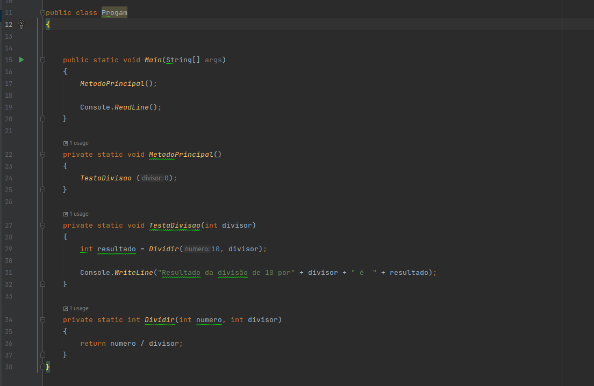

No programa acima ao ser execupado séra buscado um metodo Main e logo o programa ira tenta resolver o
**MetodoPrincipal()** antes de parti para **Console.ReadLine()** e ira 
ser feito o processo de empilhamento de execução ficando da seguinte forma:

```
Dividir <-
TestaDivisao
MetodoPrincipal
Main

```

No exemplo acima tentamos realizar uma divisão por 0 no qual o mecanimos ira desipilhar até encontrar um tratamento adequando para seu tratamento.

```
Unhandled exception. System.DivideByZeroException: Attempted to divide by zero.
   at Progam.Dividir(Int32 numero, Int32 divisor) in /home/john/projetos/c#/sololearn/atividade01/atividade01/Program.cs:line 36
   at Progam.TestaDivisao(Int32 divisor) in /home/john/projetos/c#/sololearn/atividade01/atividade01/Program.cs:line 29
   at Progam.MetodoPrincipal() in /home/john/projetos/c#/sololearn/atividade01/atividade01/Program.cs:line 24
   at Progam.Main(String[] args) in /home/john/projetos/c#/sololearn/atividade01/atividade01/Program.cs:line 17
```

Note que ao rola a execução é feito um desimpilhamento até chega ao final que é o caso do metodo Man já que no foi encontrado nenhum tratamento.


## Caputar Exceções
Quando você precisa trata exceções que foram lançadas vc precisa envover o codigo com bloco **try{ }** seguido por um bloco **catch { }**

Ex: 
```
public static void Main(String[] args)
{
    MetodoPrincipal();

    Console.ReadLine();
}

private static void MetodoPrincipal()
{
    TestaDivisao (0);
}

private static void TestaDivisao(int divisor)
{
    try
    {
        var resultado = Dividir(10, divisor);

        Console.WriteLine("Resultado da divisão de 10 por {0} é {1}", divisor , resultado);
    }
    catch (DivideByZeroException)
    {
        Console.WriteLine("Não é possível dividir um número por 0!");
    }
}

private static int Dividir(int numero, int divisor)
{
    return numero / divisor;
}

Saida:
Não é possível dividir um número por 0!

```

## Relança Exceções

Geralmente precisa relação exceções quando queremos realizar alum procedimento e depois repassa a exceção como uma possivel geração de LOG ou etc.

Devemos ter cuidado em como iremos relançao essa exceção para não perdemos o controle de pilhar de exercução como foi mostrado acima.  
Irei mostra como relação uma exceções no qual perdemos o controle da Pilhar e outro matendo o controle de pilhar de exceção.

Ex:

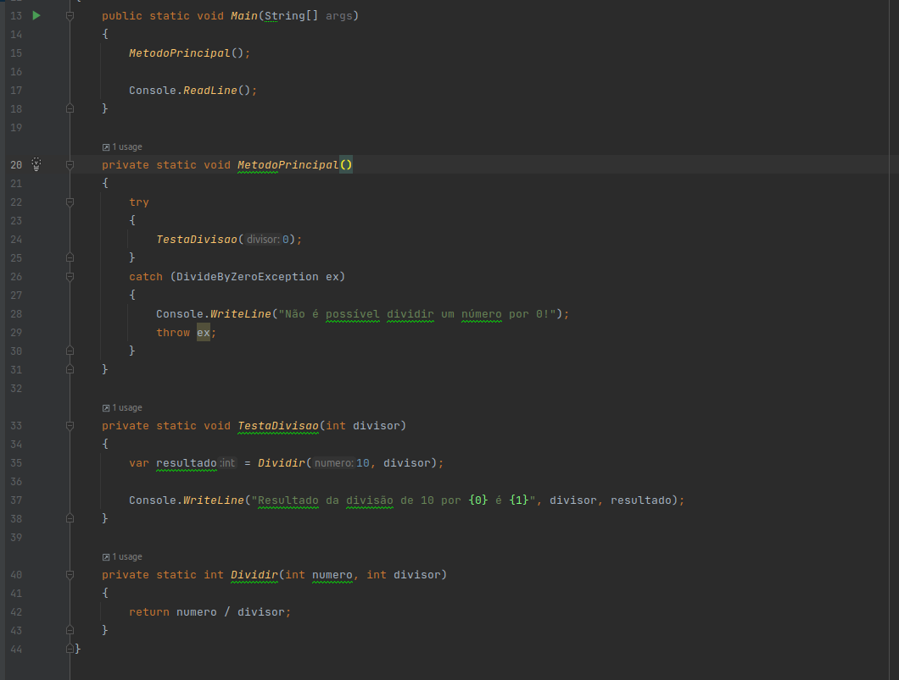

No exemplo acima teremos o seguinte **StackTrace**:

```
Não é possível dividir um número por 0!
Unhandled exception. System.DivideByZeroException: Attempted to divide by zero.
   at Progam.MetodoPrincipal() in /home/john/projetos/c#/sololearn/atividade01/atividade01/Program.cs:line 29
   at Progam.Main(String[] args) in /home/john/projetos/c#/sololearn/atividade01/atividade01/Program.cs:line 15
```

Note que relaçamos a exceção porem perdemos o controle total da pilhar como ocorreu no exemplo aterior que foi:

```
Unhandled exception. System.DivideByZeroException: Attempted to divide by zero.
   at Progam.Dividir(Int32 numero, Int32 divisor) in /home/john/projetos/c#/sololearn/atividade01/atividade01/Program.cs:line 36
   at Progam.TestaDivisao(Int32 divisor) in /home/john/projetos/c#/sololearn/atividade01/atividade01/Program.cs:line 29
   at Progam.MetodoPrincipal() in /home/john/projetos/c#/sololearn/atividade01/atividade01/Program.cs:line 24
   at Progam.Main(String[] args) in /home/john/projetos/c#/sololearn/atividade01/atividade01/Program.cs:line 17
```

Para que possamos ter todo o controle de pilhar devemos fazer da seguinte forma:


```
public class Progam
{
    public static void Main(String[] args)
    {
        MetodoPrincipal();

        Console.ReadLine();
    }

    private static void MetodoPrincipal()
    {
        try
        {
            TestaDivisao(0);
        }
        catch (DivideByZeroException ex)
        {
            Console.WriteLine("Não é possível dividir um número por 0!");
            throw;
        }
    }

    private static void TestaDivisao(int divisor)
    {
        var resultado = Dividir(10, divisor);

        Console.WriteLine("Resultado da divisão de 10 por {0} é {1}", divisor, resultado);
    }

    private static int Dividir(int numero, int divisor)
    {
        return numero / divisor;
    }
}
Saida:

Não é possível dividir um número por 0!
Unhandled exception. System.DivideByZeroException: Attempted to divide by zero.
   at Progam.Dividir(Int32 numero, Int32 divisor) in /home/john/projetos/c#/sololearn/atividade01/atividade01/Program.cs:line 42
   at Progam.TestaDivisao(Int32 divisor) in /home/john/projetos/c#/sololearn/atividade01/atividade01/Program.cs:line 35
   at Progam.MetodoPrincipal() in /home/john/projetos/c#/sololearn/atividade01/atividade01/Program.cs:line 24
   at Progam.Main(String[] args) in /home/john/projetos/c#/sololearn/atividade01/atividade01/Program.cs:line 15

```

## Finaly 

Imagine agora que mesmo ocorrendo uma exceção vc quer garantir algumas coisas como por exemplo o fechamento de um arquivo.
Nessa situação usando o bloco **finaly{}** para que possamos fechar uma coneção ou tr abertura de arquivo, algo que você precisa
que seja fechado ou liberado, para que libere recurso.

Ex :

```

StreamWriter stream = null;
try
{
    stream = File.CreateText(“meu_aquivo.txt”);
    throw new InvalidOperationException("ocorreu qualquer erro");
}
catch (InvalidOperationException ex)
{
   
   Console.WriteLine(ex.Message);
}
finally
{
   if (stream != null)
   {
      stream.Close();
   }
}

```

## NullReferenceException
A exceção que é gerada quando ocorre uma tentativa de desreferenciar um objeto de referência nula.

Um dos maiores problemas da linguagem Java e C#, realmente ai é que o bixo pega, porque significar que você deixou de fazer algo rsss.  
Exceção é gerada quando você tenta acessar um membro em um tipo cujo valor é null.

Pra evitar esse tipo de erro é aconselhavel criar Classe com uma tipagem que refletem bem o cenário, assim os compiladores atuais
podem lhe avisar que aquela propriedade ou objeto podem ser nulo.

Iniciar as variaveis sempre que possivel.


## Classes

É um conjunto de características e comportamentos que definem o conjunto de objetos ou propriedades ou metodos em comum.

Imagine um Carro, todo carro tem algumas caracteristas e comportamento como

Cor, portencia do motor, quantidade de portas, cãmbio automático e etc. Como o mesmo também possui comportamento como 
acelerar, desacelerar,acender farois, tocar musicar e etc.  
Podemos dizer então que que um carro novo é um objeto onde suas caracteristicas são seus atributos e que seu comportamento são 
ações ou métodos.

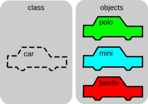


Abstraindo um pouco a analogia, uma classe é um conjunto de características e comportamentos que definem o conjunto de objetos pertencentes à essa classe.

### Exemplo


```

public class Carro
{
    public string Cor { get; set; }
    public int Ano { get; set; }
    public string Modelo { get; set; }
    public int QuantidadePortas { get; set; }

    public void Acelerar()
    {
        // implementar
    }
    
    public void Frear()
    {
        // implementar
    }
    
    public void TocaMusica()
    {
        // implementar
    }
    
    public void LigarArCondicionado()
    {
        // implementar
    }
}

```

## Encapsulamento

Ainda usando a analogia do carro, sabemos quer ele possui algumas caracteristicas e comportamentos. O método acelerar altera
a velocidade atual do carro, como tambem seu consumo de combustivel.

No entando se algumas dessas caracteristicas que sofrem alteração diante de um comportamente, que apenas o comportamente deve alterar o seu valor
puder ser alterado facilmente, podemos ter como resultado efeitos colaterais imprevisiveis.

Tais como seu carro está acelerando e se encontra em uma velocidade atual de 100km e do nada ele passa a valer 0km, sem ter ocorrido uma
frenagem ou falta de combustivel. 

Então nesse caso a velocidade atual do carro não está visil para alteração por fora do proprio carro.

Então como sabemos como nosso carro acelerar, não sabemos, o que precisamos saber é que para acelerar precisamos pisar no 
acelerador, cabe ao carro saber como é feito para acelerar o carro. Assim podemos dizer que a velocidade do carro está 
**encapsulada**.


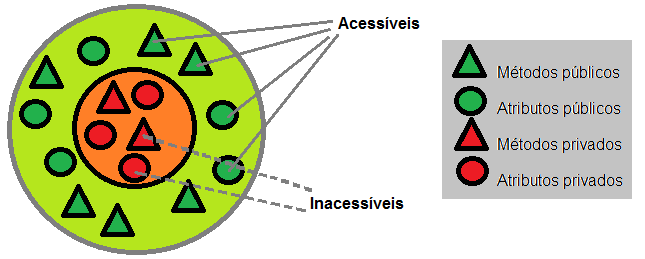

### Exemplo


```
public class Carro
{
    public string Cor { get; set; }
    public int Ano { get; set; }
    public string Modelo { get; set; }
    public int QuantidadePortas { get; set; }
    public double VelocidadeAtual { get;private set; }
    public double CombustivelAtual { get;private set; }
    
    public void Acelerar(int tempoSeg)
    {
        VelocidadeAtual += tempoSeg * 10;
        UsarMaisCombustivel();
        
    }
    
    public void Frear(int tempoSeg)
    {
        VelocidadeAtual -= tempoSeg * 15;
    }
    
    public void LigarArcondicionado()
    {
        
    }

    private void UsarMaisCombustivel()
    {
        CombustivelAtual -= VelocidadeAtual * 0.0003;
    }
}

```

Como pode nota tanto a foi encapsulada a propriedade CombustivelAtual e VelocidadeAtual, para não sofre alterações externas
como também o método UsarMaisCombustivel está visivel somente para o carro. Assim podemos evitar efeitos colaterais como do nada o carro ficar sem combustivel
ou ficar parado.

## Herança
No nosso exemplo anterior você viu que nosso carro ele possuei algumas caracteristicas e também comportamentos agora imagine o seguinte
Imagine que possar ter um modelo de carro no qual ele faz as mesmas coisa e tenha quase todas as suas caracteristicas
abstraindo para o mundo real imagine que na nossa loja de carros podemo ter um Honda Civic com Cambio manual e automatico
podemos nota que temos somente nota que temos uma pequena diferença no caso.

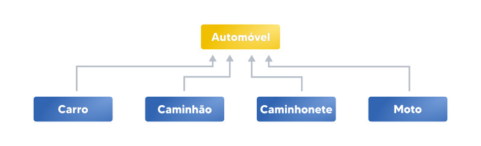

Podemos dizer quer uma Classe A é um tipo de classe B, dizemos que a classe **A** herda as caracteristica da classe **B**

## Exemplo


```

public enum TipoCambio
{
    AUTOMATICO,
    MANUAL
}

public class Carro
{
    public string Cor { get; set; }
    public int Ano { get; set; }
    public string Modelo { get; set; }
    public int QuantidadePortas { get; set; }
    public double VelocidadeAtual { get;private set; }
    public double CombustivelAtual { get;private set; }
    public TipoCambio TipoCambio { get; set; }
    
    
    public Carro(string modelo,TipoCambio tipoCambio)
    {
        modelo = modelo;
        TipoCambio = tipoCambio;    
    }

}

public class HondaCivicPeDuro:Carro
{

    public HondaCivicPeDuro() : base("HondaCivicPeDuro",TipoCambio.MANUAL)
    {
    
    }
}

public class HondaCivicSit:Carro
{

    public HondaCivicPeDuro() : base("HondaCivicSit",TipoCambio.AUTOMATICO)
    {
    
    }
}

```

Como podem observa temos dois modelo de carros diferente, porem com as mesma caracteristica da **Classe Carro**.

## Polimorfismo

polimorfismo vem do grego poli = muitas, morphos = forma, como o seu nome já diz, é uma forma 
de duas classes diferentes, têm um mesmo método que é implementado de formas diferentes.

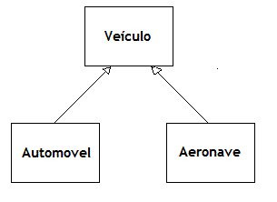

```
public enum TipoCambio
{
    AUTOMATICO,
    MANUAL
}

public abstract class Veiculo
{
    public string Cor { get; set; }
    public int Ano { get; set; }
    public string Modelo { get; set; }
    public int QuantidadePortas { get; set; }
    public TipoCambio TipoCambio { get; set; }
    public double VelocidadeAtual { get;protected set; }
    public double CombustivelAtual { get;protected set; }
    public bool Ligado { get; protected set; }


    public abstract void Acelerar(int tempoSeg);


    public abstract void Frear(int tempoSeg);
    
}


public class Moto150Cilindradas:Veiculo
{
    public override void Acelerar(int tempoSeg)
    {
        VelocidadeAtual += tempoSeg * 12;
    }

    public override void Frear(int tempoSeg)
    {
        VelocidadeAtual -= tempoSeg * 15;
    }
}

public class Moto1000Cilindradas:Veiculo
{
    public override void Acelerar(int tempoSeg)
    {
        VelocidadeAtual += tempoSeg * 20;
    }

    public override void Frear(int tempoSeg)
    {
        VelocidadeAtual += tempoSeg * 18;
    }
}


public class HondaCivic:Veiculo
{
    public override void Acelerar(int tempoSeg)
    {
        VelocidadeAtual += tempoSeg * 20;
    }

    public override void Frear(int tempoSeg)
    {
        VelocidadeAtual -= tempoSeg * 18;
    }
}

public class Gol:Veiculo
{
    public override void Acelerar(int tempoSeg)
    {
        VelocidadeAtual += tempoSeg * 12;
    }

    public override void Frear(int tempoSeg)
    {
        VelocidadeAtual -= tempoSeg * 15;
    }
}


Veiculo bis = new Moto150Cilindradas();
Veiculo r1 = new Moto1000Cilindradas();
Veiculo gol = new Gol();
Veiculo civic = new HondaCivic();

bis.Acelerar(5);
r1.Acelerar(5);
gol.Acelerar(5);
civic.Acelerar(5);

Console.WriteLine("Velocidade atual da bis {0}", bis.VelocidadeAtual);
Console.WriteLine("Velocidade atual da R1 {0}", r1.VelocidadeAtual);
Console.WriteLine("Velocidade atual do GOL {0}", gol.VelocidadeAtual);
Console.WriteLine("Velocidade atual do CIVIC {0}", civic.VelocidadeAtual);


Saida:

Velocidade atual da bis 60
Velocidade atual da R1 125
Velocidade atual do GOL 75
Velocidade atual do CIVIC 100


```

Podemos nota que 4 objetos do tipo veiculo é executado o comportamento Acelerar porem temos reusltado diferentes para cada 1.


## S.O.L.I.D

### 1. SRP — Single Responsibility Principle(Principio da responsabildiade unica)
"O princípio da responsabilidade única declara que uma classe deve fazer apenas uma coisa e, portanto, deve ter apenas uma razão para ser modificada."

*Métodos devem ter uma única responsabildiade.
*Classes também devem ter uma única responsabildiade.
*Responsabilidade do método é diferente da responsabildiade da Classe.

Metodos tem que ter apenas uma unica intenção, Classes deve apenas a unica agente de mudança

Ou seja Metodos e Classes coesas, nos permite bucar ou usar uma unica fonte de informação.


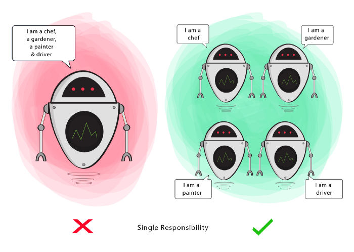

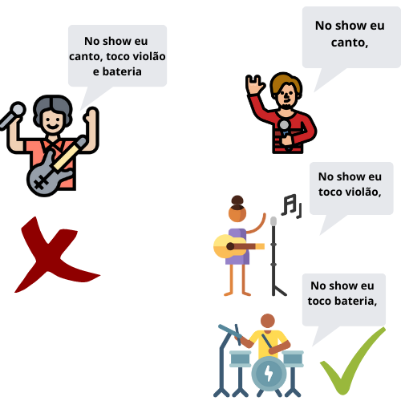


### Exemplo

Imagine agora o cenário onde queremos criar uma classe no qual podemos vender nossos carros e gerar
algumas informações como imprimir comprovante e salvar os dados.


```

public class Pedido
{

    public Pedido()
    {
        Itens = new List<ItemPedido>();
    }
    
    public decimal Sutotal { get; set; }
    public decimal Total { get; set; }
    public decimal Desconto { get; set; }
    public List<ItemPedido> Itens;


    public void AdicionarItem(ItemPedido item)
    {
        Itens.Add(item);
        CalcularTotal();
    }

    private void CalcularTotal()
    {
        Sutotal = Itens.Sum(item => item.SubTotal);
        Desconto = Itens.Sum(item => item.Desconto);
        Total = Itens.Sum(item => item.Total);
    }

    private void Imprimir()
    {
        Console.WriteLine("---- Pedido -----");
        Console.WriteLine("Subtotal: {0}",Sutotal);
        Console.WriteLine("Desconto: {0}",Desconto);
        Console.WriteLine("Total: {0}",Total);
        Console.WriteLine();
        Console.WriteLine("------ Itens --------");
        Console.WriteLine("------------------------------------------");
        foreach (var item in Itens)
        {
            
            Console.WriteLine("Nome                  QTD    DESC   TOTAL");
            Console.WriteLine(item.Veiculo);
            Console.WriteLine("                      {0}    {1}      {2}",item.Quantidade,item.Desconto,item.Total);
        }
        Console.WriteLine("------------------------------------------");
        
    }

    private void SalvarDados()
    {
        // criar um arquivos XML com os dados da Venda
    }

    private void EnviarMensagem()
    {
        // enviar mensagem por SMS
    }

}

public class ItemPedido
{
    public Veiculo Veiculo { get; set; }
    public decimal Quantidade { get; set; }
    public decimal ValorUnitario { get; set; }
    public decimal Desconto { get; set; }
    public decimal SubTotal { get; private set; }
    public decimal Total { get; private set; }

    public ItemPedido(Veiculo veiculo, decimal quantidade, decimal valorUnitario, decimal desconto)
    {
        Veiculo = veiculo;
        Quantidade = quantidade;
        ValorUnitario = valorUnitario;
        Desconto = desconto;
        CalcularTotais();
    }

    private void CalcularTotais()
    {
        SubTotal = Quantidade * ValorUnitario;
        Total = SubTotal - Desconto;
    }
}
```

Acima temos nossa Classe Pedido que contem alguns comportamentos

* **CalcularTotal**
* **Imprimir**
* **SalvarDados**
* **EnviarMensagem**  

O que podemos nota aqui ? Nossa classe Pedido ele viola o princípio da responsabildiade unica de diversas maneiras

A Primeira violçao está no metódo **Imprimir** no fizemos nossa logica de impressão, que no momento está 
imprimir no Console, mais podemos mudar para imprimir numa impressora, ou seja, de acordo com **SRP** 
nossa classe deve ter apenas uma unica razão para ser alterada.

A Segunda violação é a persistencia de dados que estamos salvando em um arquivo XML, porem podemos mudar para um
banco de dados

E a terceira violação seria o envio de mensagem por SMS. Então como poderiamos arrumar esse problema ???  

Segue a solução

```

public class Pedido
{

    public Pedido()
    {
        Itens = new List<ItemPedido>();
    }
    
    public decimal Sutotal { get; set; }
    public decimal Total { get; set; }
    public decimal Desconto { get; set; }
    public List<ItemPedido> Itens;


    public void AdicionarItem(ItemPedido item)
    {
        Itens.Add(item);
        CalcularTotal();
    }

    private void CalcularTotal()
    {
        Sutotal = Itens.Sum(item => item.SubTotal);
        Desconto = Itens.Sum(item => item.Desconto);
        Total = Itens.Sum(item => item.Total);
    }

}

public class ItemPedido
{
    public Veiculo Veiculo { get; set; }
    public decimal Quantidade { get; set; }
    public decimal ValorUnitario { get; set; }
    public decimal Desconto { get; set; }
    public decimal SubTotal { get; private set; }
    public decimal Total { get; private set; }

    public ItemPedido(Veiculo veiculo, decimal quantidade, decimal valorUnitario, decimal desconto)
    {
        Veiculo = veiculo;
        Quantidade = quantidade;
        ValorUnitario = valorUnitario;
        Desconto = desconto;
        CalcularTotais();
    }

    private void CalcularTotais()
    {
        SubTotal = Quantidade * ValorUnitario;
        Total = SubTotal - Desconto;
    }
}

public class Imprimir
{
    
    public class Imprimir
    {
        
        public void ImprimirViaConsole(Pedido pedido)
        {
            Console.WriteLine("------------- Pedido --------------------");
            Console.WriteLine("Subtotal: {0}",pedido.Sutotal);
            Console.WriteLine("Desconto: {0}",pedido.Desconto);
            Console.WriteLine("Total: {0}",pedido.Total);
            Console.WriteLine();
            Console.WriteLine("--------------- Itens --------------------");
            Console.WriteLine("------------------------------------------");
            foreach (var item in pedido.Itens)
            {
                
                Console.WriteLine("Nome                  QTD    DESC   TOTAL");
                Console.WriteLine(item.Veiculo);
                Console.WriteLine("                      {0}    {1}      {2}",item.Quantidade,item.Desconto,item.Total);
            }
            Console.WriteLine("------------------------------------------");
            
        }
    }
}

public class PedidoDao
{
    public void Salvar(Pedido pedido)
    {
        // criar um arquivos XML com os dados da Venda
    }
}

public class Notificar
{
    public void EnviarSMS(Pedido pedido)
    {
        // enviar mensagem por SMS
    }
}

public class PedidoServico
{

    public void Faturar(Pedido pedido)
    {
        var dao = new PedidoDao();        
        dao.Salvar(pedido);                  
    }    
}

```

Agora nossa Classe obeder ao princípio da responsabilidade única e cada Classe é responsável por um 
aspecto.

## Open-Closed Principle (Princípio Aberto-Fechado

O principio de aberto/fechado diz que as classes devem está abertas para extensão, mais fechadas para modificações.

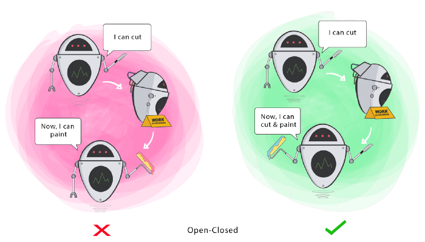

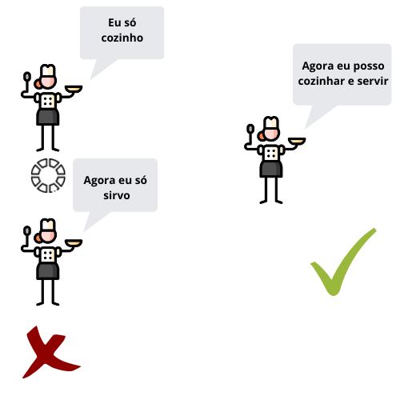

Isso representa que devemos ser capaz de adicionar novas funcionabilidades, sem ter que modificar codigo existente, 
assim evitamos possivels BUGS, teste que estavam funcionando parar de funcionar.


Imagine o seguinte cénario, agora que nosso time entrega as funções de persistencia em arquivo XML, nosso
PM também soliciar que o sistema seja capaz de também salvar em um banco de dados.

## Ex:

```

public class PedidoDao
{

    private Pedido _pedido;

    public PedidoDao(Pedido pedido)
    {
        _pedido = pedido;
    } 

    private void SalvarXML(Pedido pedido)
    {
        // criar um arquivos XML com os dados da Venda
    }
    
    private void SalvarNoBanco(Pedido pedido)
    {
        // salvo o pedido no banco
    }
}

public class PedidoServico
{

    public void Faturar(Pedido pedido)
    {
        var dao = new PedidoDao();
        dao.SalvarXML(pedido);
       
    }    
}

```

Dessa forma nossa classe ganho o poder de salvar no banco, porem foi modificado de tal forma que terei
que ajusta o lugar que está sendo usada. 

## Então como posso resolver isso ??? Usando o principio OCP


```

public class IPedidoDao
{
    void Salvar(Pedido pedido)
}

public class PedidoDaoXml:IPedidoDao
{
    public void Salvar(Pedido pedido)
    {
        // criar um arquivos XML com os dados da Venda
    }
}

public class PedidoDaoEF:IPedidoDao
{
    public void Salvar(Pedido pedido)
    {
        // salva no banco usando EntityFramWork
    }
}

public class PedidoDao()
{
    private PedidoDaoEF _daoBancoDados;
    private PedidoDaoXml _daoXml;
    
    public PedidoDao(PedidoDaoEF daoBancoDados,PedidoDaoXml daoXml)
    {
        _daoEF = daoBancoDados;
        _daoXml = daoXml;        
    }
    
    public void Salvar(Pedido pedido)
    {
        _daoEF.Salvar(pedido);
        _daoXml.Salvar(pedido);
    }
}


public class PedidoServico
{

    public void Faturar(Pedido pedido)
    {
        PedidoDao dao = new PedidoDao(new PedidoDaoEF(),new PedidoDaoXml());
        
        dao.Salvar(pedido)
    }
    
}

```

## Liskov Substitution Principle (Princípio da substituição de Liskov)

Liskov veio de Barbara Liskov, que foi uma cientista americana que trouxe a ideia de que “As classes derivadas devem ser substituíveis pelas suas classes bases”.

Isso que dizer que se uma Classe B for uma SubClass de A devemos passa B para qualquer objeto que espere A
e não temos resultados estranho

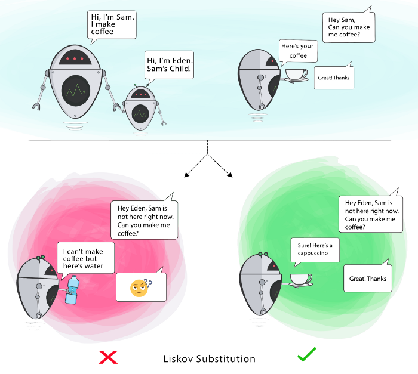

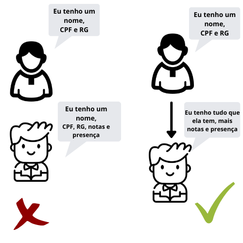


Imagine a seguinte situação atualmente hoje apendas faturamos para pessoas judicas e imprimimos 
o endereco de entrega no pedido, porem agora nossa empresa quer também faturar para pessoa fisica e 
também imprimir.


Vamos simular as seguinte situações:

```

public class PessoaJuridica
{
    public string Nome { get; set; }
    public string Endereco { get; set; }
    public string Cnpj { get; set; }
}

public class Pedido
{

    public Pedido()
    {
        Itens = new List<ItemPedido>();
    }

    public PessoaJuridica Cliente { get; set; }
    public decimal Sutotal { get; set; }
    public decimal Total { get; set; }
    public decimal Desconto { get; set; }
    public List<ItemPedido> Itens;


    public void AdicionarItem(ItemPedido item)
    {
        Itens.Add(item);
        CalcularTotal();
    }

    private void CalcularTotal()
    {
        Sutotal = Itens.Sum(item => item.SubTotal);
        Desconto = Itens.Sum(item => item.Desconto);
        Total = Itens.Sum(item => item.Total);
    }

}

public class Imprimir
{
    
    private void ImprimirViaConsole(Pedido pedido)
    {
        Console.WriteLine("------------- Pedido --------------------");
        Console.WriteLine("Cliente: {0}",pedido.Cliente.Nome);
        Console.WriteLine("Subtotal: {0}",pedido.Sutotal);
        Console.WriteLine("Desconto: {0}",pedido.Desconto);
        Console.WriteLine("Total: {0}",pedido.Total);
        Console.WriteLine();
        Console.WriteLine("--------------- Itens --------------------");
        Console.WriteLine("------------------------------------------");
        foreach (var item in pedido.Itens)
        {
            
            Console.WriteLine("Nome                  QTD    DESC   TOTAL");
            Console.WriteLine(item.Veiculo);
            Console.WriteLine("                      {0}    {1}      {2}",item.Quantidade,item.Desconto,item.Total);
        }
        Console.WriteLine("------------------------------------------");
        Console.WriteLine();
        Console.WriteLine("Endereco de entrega: {0}",pedido.Cliente.Endereco);
        
    }
}

public class PedidoServico
{

    public void Faturar(Pedido pedido)
    {
        Imprimir impressao = new Imprimir();
        
        impressao.ImprimirViaConsole(pedido)
    }
    
}

```
No nosso codigo atual ele só sabe faturar para Pessoa Juridica, aplicando o principio de LSP para ele possa vender para
Pessoa fisica e não sobre efeitos colaterais


```

public class Pessoa
{
    public string Nome { get; set; }
    public string Endereco { get; set; }
}

public class PessoaFisica:Pessoa
{    
    public string Cpf { get; set; }
}

public class PessoaJuridica:Pessoa
{  
    public string Cnpj { get; set; }
}

public class Pedido
{

    public Pedido()
    {
        Itens = new List<ItemPedido>();
    }

    public Pessoa Cliente { get; set; }
    public decimal Sutotal { get; set; }
    public decimal Total { get; set; }
    public decimal Desconto { get; set; }
    public List<ItemPedido> Itens;


    public void AdicionarItem(ItemPedido item)
    {
        Itens.Add(item);
        CalcularTotal();
    }

    private void CalcularTotal()
    {
        Sutotal = Itens.Sum(item => item.SubTotal);
        Desconto = Itens.Sum(item => item.Desconto);
        Total = Itens.Sum(item => item.Total);
    }

}

public class Imprimir
{
    
    private void ImprimirViaConsole(Pedido pedido)
    {
        Console.WriteLine("------------- Pedido --------------------");
        Console.WriteLine("Cliente: {0}",pedido.Cliente.Nome);
        Console.WriteLine("Subtotal: {0}",pedido.Sutotal);
        Console.WriteLine("Desconto: {0}",pedido.Desconto);
        Console.WriteLine("Total: {0}",pedido.Total);
        Console.WriteLine();
        Console.WriteLine("--------------- Itens --------------------");
        Console.WriteLine("------------------------------------------");
        foreach (var item in pedido.Itens)
        {
            
            Console.WriteLine("Nome                  QTD    DESC   TOTAL");
            Console.WriteLine(item.Veiculo);
            Console.WriteLine("                      {0}    {1}      {2}",item.Quantidade,item.Desconto,item.Total);
        }
        Console.WriteLine("------------------------------------------");
        Console.WriteLine();
        Console.WriteLine("Endereco de entrega: {0}",pedido.Cliente.Endereco);
        
    }
}

public class PedidoServico
{

    public void Faturar(Pedido pedido)
    {
        Imprimir impressao = new Imprimir();
        
        impressao.ImprimirViaConsole(pedido)
    }
    
}

public static void Main(String[] args)
{

    var pedidoPJ = new Pedido();
    pedidoPJ.Cliente = new PessoaJuridica();
    
    var pedidoPF = new Pedido();
    pedidoPF.Cliente = new PessoaFisica();

    Imprimir imprimir = new Imprimir();
    
    imprimir.ImprimirViaConsole(pedidoPJ);
    imprimir.ImprimirViaConsole(pedidoPF);

}

```

Usando herança eu poderei faturar pedido tanto para Pessoa Fisica quanto Juridica e não terei nenhum efeito colateral na minha impressão.


## ISP — Interface Segregation Principle(Princípio da Segregação da Interface)

Uma classe não deve ser forçada a implementar interfaces e métodos que não irão utilizar.

Esse principio lhe orietar a ter mais interfaces mais especificas do que apenas uma que sabe faz tudo.


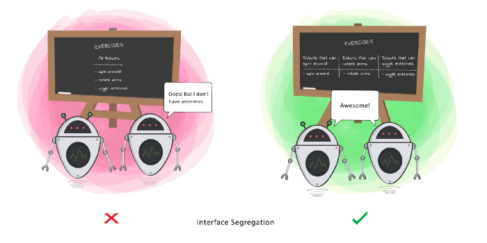

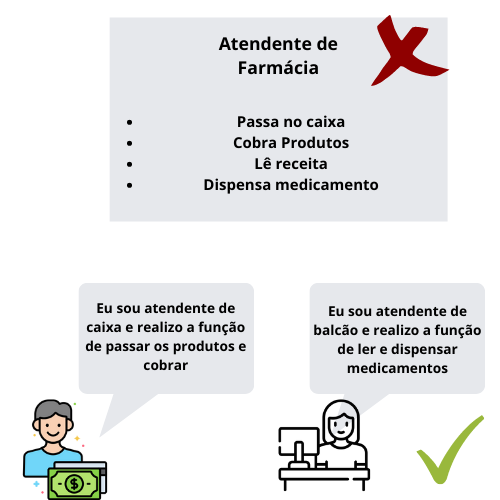

Imagine o seguinte cenario quando chega um cliente temos que atender, anota o pedido, faturar e imprimir.

Para isso teriamos seguinte contrato de comportamento para nossa Classe:


```

public class IVender
{
    void Atender(Cliente cliente);
    Pedido CriarPedido(Cliente cliente,Veiculo);
    Faturar(Pedido pedido);
    Imprimir(Pedido pedido);
}

public class PreVenda:IVender
{

    public void Atender(Cliente cliente)
    {
        // sei atender      
    }    
    
    Pedido CriarPedido(Cliente cliente,Veiculo)
    {
        // sei cria o pedido
    }
    
    Faturar(Pedido pedido)
    {
       // não faço nada
    }
    
    Imprimir(Pedido pedido)
    {
        // não sei imprimir
    }
}

public class VendaBalcao:IVender
{

    public void Atender(Cliente cliente)
    {
        // sei atender      
    }    
    
    Pedido CriarPedido(Cliente cliente,Veiculo)
    {
        // não sei cria o pedido
    }
    
    Faturar(Pedido pedido)
    {
       // sei faturar
    }
    
    Imprimir(Pedido pedido)
    {
        // sei imprimir
    }
}


```

O problema é ser muito específica. Por causa disso, nossa classe VendaBalcao e PreVenda
foi forçada a implementar métodos relacionados que são irrelevantes. Vamos separar o segregar as interfaces.

```

public class IAtender
{
    void Atender(Cliente cliente);    
}

public class IPreVenda:IAtender
{   
    Pedido CriarPedido(Cliente cliente,Veiculo);   
}

public class IVendaBalcao:IAtender
{   
    Faturar(Pedido pedido);
    Imprimir(Pedido pedido);  
}

public class PreVenda:IPreVenda
{

    public void Atender(Cliente cliente)
    {
        // sei atender      
    }    
    
    Pedido CriarPedido(Cliente cliente,Veiculo)
    {
        // sei cria o pedido
    }
   
}

public class VendaBalcao:IVendaBalcao
{

    public void Atender(Cliente cliente)
    {
        // sei atender      
    }
    
    Faturar(Pedido pedido)
    {
       // sei faturar
    }
    
    Imprimir(Pedido pedido)
    {
        // sei imprimir
    }
}

```

Agora, nosso modelo é muito mais flexível, extensível não precisam implementar lógica irrelevante para
o que realmente importar para seu contexto.

## DIP — Dependency Inversion Principle(Dependa de abstrações e não de implementações)
eclara que nossas classes devem depender de interfaces ou de classes abstratas em vez de classes concretas e de funções.

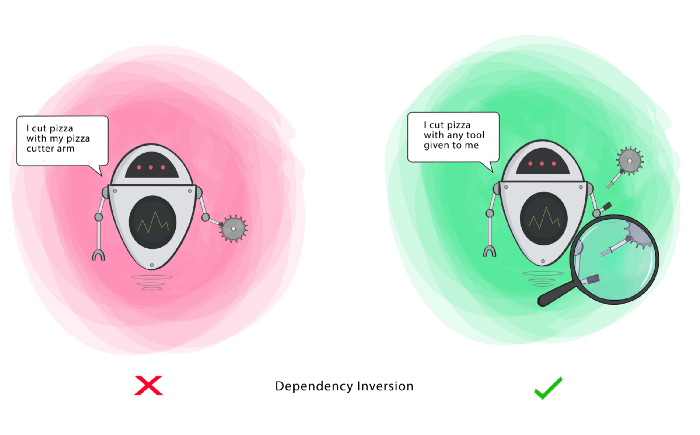


Como podem nota sempre que faturamos um pedido fazemos a impressão atualmente pelo Console, ou seja, nossa
Classe que gerencia o faturamente ele sabe que toda vez que faturar ele tem que imprimir, porem quando fomos mudar para uma impressão fisica ele
tera que conhecer também então como podemos resolver ?


```

public interface IImprimir
{
    void Imprimir(Pedido);
}


public class ImprimirViaConsole:IImprimir
{
    
    public void Imprimir(Pedido pedido)
    {
        Console.WriteLine("------------- Pedido --------------------");
        Console.WriteLine("Cliente: {0}",pedido.Cliente.Nome);
        Console.WriteLine("Subtotal: {0}",pedido.Sutotal);
        Console.WriteLine("Desconto: {0}",pedido.Desconto);
        Console.WriteLine("Total: {0}",pedido.Total);
        Console.WriteLine();
        Console.WriteLine("--------------- Itens --------------------");
        Console.WriteLine("------------------------------------------");
        foreach (var item in pedido.Itens)
        {
            
            Console.WriteLine("Nome                  QTD    DESC   TOTAL");
            Console.WriteLine(item.Veiculo);
            Console.WriteLine("                      {0}    {1}      {2}",item.Quantidade,item.Desconto,item.Total);
        }
        Console.WriteLine("------------------------------------------");
        Console.WriteLine();
        Console.WriteLine("Endereco de entrega: {0}",pedido.Cliente.Endereco);
        
    }
}

public class ImprimirViaImpressora:IImprimir
{
    public void Imprimir(Pedido pedido)
    {   
       // metodo para imprimir via impressora     
    }
}

public class PedidoServico
{
    private IImprimir _metodoImpressao;

    public PedidoServico(IImprimir metodoImpressao)
    {
        _metodoImpressao = metodoImpressao;
    }

    public void Faturar(Pedido pedido)
    {   
        _metodoImpressao.Imprimir(pedido)
    }
    
}

public static void Main(String[] args)
{

    var pedidoPJ = new Pedido();
    pedidoPJ.Cliente = new PessoaJuridica();
    
    var pedidoPF = new Pedido();
    pedidoPF.Cliente = new PessoaFisica();

    Imprimir imprimir = new Imprimir();
    
    PedidoServico servico = new PedidoServico(new ImprimirViaImpressora());
    
    servico.Faturar(pedidoPJ);
}

```

Ou seja assim nosso servico só precisa saber que precisa imprimir, como vai ser impresso isso não é de seu interesse.


